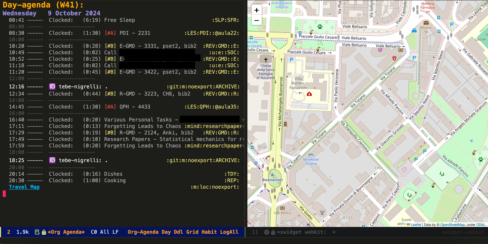

# What is Emacs? 
If you are familiar with Vim, think of Emacs as Vim, and Doom Emacs as Neovim, and skip to the [next section](#My%20config).

[Emacs](https://www.gnu.org/software/emacs/) is an open source text editor with lots of features and built-in room for further customisation with internal and external plugins: you inherit a complicated and ugly-looking piece of software and over the years you extend it with scripts, change shortcuts and add features until the program becomes aligned with your needs. 

All of this works because Emacs, despite being mostly written in C, contains an interpreter for the Emacs-Lisp language, so you can add and run code in runtime, in the same Emacs instance you are working on. You can redefine variables, inspect them and change pretty much anything, while the program runs.

As for [Doom](https://github.com/doomemacs/doomemacs), according to the official repository:
> Doom is a configuration framework for GNU Emacs tailored for Emacs bankruptcy veterans who want less framework in their frameworks, a modicum of stability (and reproducibility) from their package manager, and the performance of a hand rolled config (or better).

# My config
I was originally drawn to Emacs while looking for a tool to write thoughts in a coding-compatible environment, with the goal of integrating some specific features that I wanted. I had already written my own simple text editor with Java, but I wanted something more powerful so I began exploring existing tools, namely [Obsidian](https://obsidian.md/) and [Joplin](https://joplinapp.org/), until I eventually found [org-roam](https://github.com/org-roam/org-roam-ui), which convinced me to switch to Emacs and the [org-mode](https://orgmode.org/) package, which I now use on an hourly basis.

Since the summer of 2022, I have maintained my own config of Doom Emacs, changing it to my liking through the integration of Python, Shell and Emacs-lisp script. I am uploading it here so it can be a reference for other people.

## Some useful customisations 

### Logging Shortcuts

After getting into [Quantified Self](https://quantifiedself.com/), the systemic collection of personal data for analysis, I set up a system of shortcuts through plugins and code that I hacked together in order to quickly record activities such as projects, work, study sessions and recreational activities like watching movies, series or reading books. 

I have also extended my analysis with a modified version of [Jeff Filipovits](https://github.com/legalnonsense)'s brilliant [org-clock-export](https://github.com/legalnonsense/org-clock-export) package to export all my logs as csv files, allowing me study the data with a Python Jupyter Notebook.

### Agenda with Integrated Location History

In line with my self-tracking habit, I use [GPS Logger](https://github.com/mendhak/gpslogger) on my phone to record .csv files of my location history and [Syncthing](https://github.com/syncthing/syncthing) to sync the files to my computer. With a Python script I made, I can export the files to .html maps and integrate them in the org-mode agenda. The whole process is automated and coordinated through Emacs and it allows me trace my movements at the side of my agenda. 

### Archiving Capabilities 

I also use Emacs as a way to index my files. For instance, I write timelines for sensitive documents (medical charts, identity cards) or group important tasks (maintenance, cooking recipes) in a single file to keep all information in a central place. As an example, this is the file of the websites that I archive: I have a shortcut that given a link automatically stores the websites using [org-board](https://github.com/charlesroelli/org-board) and a way to automatically display the total size of the website directory

# Related projects
I am currently working on [Attimo](https://github.com/quercia-dev/Attimo), a golang productivity app that allows users to define tables and quickly add new rows to them. The app is currently under active development, though I intend it to eventually replace my Emacs configuration.